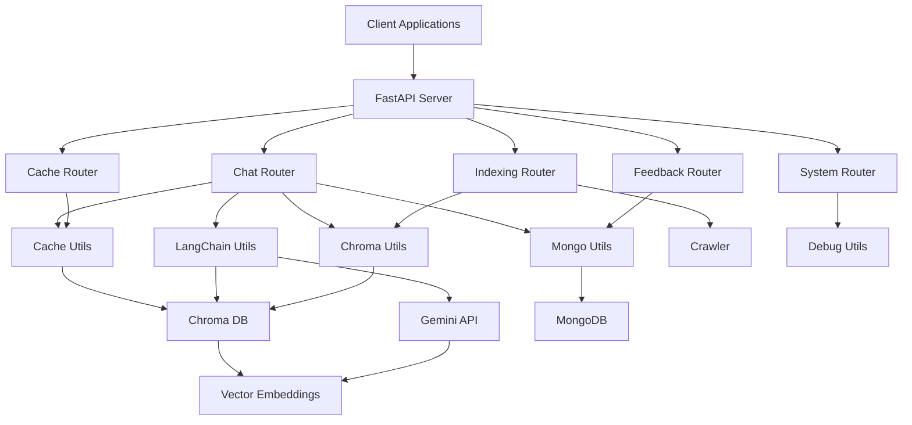

# Zendalona Chatbot Backend Architecture

## Overview

The Zendalona Chatbot is a FastAPI-based backend service that provides an accessible chatbot using LangChain, Gemini, and ChromaDB. It supports caching, document indexing, and multiple interaction modes.

## Architecture Diagram

## Core Components

### 1. Main Application (main.py)
- FastAPI application setup
- Router registration
- CORS configuration
- Logging configuration

### 2. Chat Router (routers/chat.py)
- Main chat endpoints
- Cache checking logic
- Response streaming
- WebSocket support

### 3. LangChain Utilities (utils/langchain_utils.py)
- LLM configuration
- RAG chain setup
- Prompt templates
- Response processing

### 4. Chroma Utilities (utils/chroma_utils.py)
- Vector database operations
- Document indexing
- PDF processing
- Collection management

### 5. Cache Utilities (utils/cache_utils.py)
- Cache management
- Similarity search
- Cache filtering

### 6. MongoDB Utilities (utils/mongo_utils.py)
- Feedback storage
- Temporary cache management
- Database operations

## Data Flow

1. **User Query**: Client sends query to `/chat` endpoint
2. **Cache Check**: System checks cache for similar queries
3. **Vector Search**: If no cache match, retrieve relevant documents from ChromaDB
4. **LLM Processing**: Send context + query to Gemini for response generation
5. **Response**: Return generated response with sources
6. **Caching**: Store response in cache for future similar queries
7. **Feedback**: Store user feedback in MongoDB

## Key Features

- **RAG Implementation**: Retrieval-Augmented Generation with ChromaDB
- **Caching**: Two-level caching (ChromaDB cache + MongoDB temporary cache)
- **Streaming**: Real-time response streaming via SSE
- **WebSocket**: WebSocket support for React Native apps
- **Feedback System**: User feedback collection and storage
- **Document Indexing**: Web crawling and PDF processing
- **Session Management**: Track active chat sessions